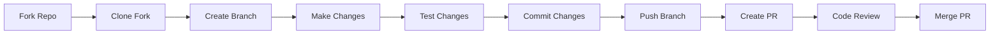

# Guide de Contribution - KidneyVision

## 🤝 Bienvenue aux Contributeurs

Merci de votre intérêt pour contribuer à KidneyVision ! Ce guide vous aidera à contribuer efficacement au projet.

## 📋 Table des Matières

- [Code de Conduite](#-code-de-conduite)
- [Comment Contribuer](#-comment-contribuer)
- [Structure du Projet](#-structure-du-projet)
- [Configuration de Développement](#-configuration-de-développement)
- [Standards de Code](#-standards-de-code)
- [Process de Pull Request](#-process-de-pull-request)
- [Reporting de Bugs](#-reporting-de-bugs)
- [Suggestions de Fonctionnalités](#-suggestions-de-fonctionnalités)

## 🛡️ Code de Conduite

### Notre Engagement

Nous nous engageons à créer un environnement ouvert et accueillant pour tous, indépendamment de:
- L'âge, la taille corporelle, le handicap
- L'ethnicité, l'identité de genre
- Le niveau d'expérience, la nationalité
- L'apparence personnelle, la race, la religion
- L'identité et l'orientation sexuelles

### Comportements Attendus

- Utiliser un langage accueillant et inclusif
- Respecter les différents points de vue et expériences
- Accepter gracieusement les critiques constructives
- Se concentrer sur ce qui est le mieux pour la communauté
- Faire preuve d'empathie envers les autres membres

### Comportements Inacceptables

- Utilisation de langage ou d'imagerie sexualisés
- Trolling, commentaires insultants/dérogatoires
- Harcèlement public ou privé
- Publication d'informations privées sans permission
- Autres conduites inappropriées dans un contexte professionnel

## 🚀 Comment Contribuer

### Types de Contributions

1. **Corrections de Bugs** - Identifier et corriger les problèmes
2. **Nouvelles Fonctionnalités** - Proposer et implémenter des améliorations
3. **Documentation** - Améliorer la documentation existante
4. **Tests** - Ajouter ou améliorer la couverture de tests
5. **Traductions** - Localiser l'interface utilisateur
6. **Performance** - Optimiser les performances
7. **Sécurité** - Identifier et corriger les vulnérabilités

### Workflow de Contribution



## 🏗️ Structure du Projet

### Frontend (React)
```
frontend/
├── src/
│   ├── components/          # Composants React
│   │   ├── ui/             # Composants UI réutilisables
│   │   ├── DicomViewer.tsx # Visualiseur DICOM
│   │   └── ...
│   ├── hooks/              # Hooks personnalisés
│   ├── pages/              # Pages de l'application
│   ├── services/           # Services API
│   ├── types/              # Types TypeScript
│   └── utils/              # Utilitaires
├── public/                 # Assets statiques
└── tests/                  # Tests frontend
```

### Backend (FastAPI)
```
backend/
├── app/
│   ├── api/               # Endpoints API
│   ├── core/              # Configuration core
│   ├── models/            # Modèles de données
│   ├── services/          # Services métier
│   └── utils/             # Utilitaires
├── data/                  # Données d'entraînement
├── notebooks/             # Jupyter notebooks
├── scripts/               # Scripts utilitaires
└── tests/                 # Tests backend
```

## ⚙️ Configuration de Développement

### 1. Fork et Clone

```bash
# Fork le projet sur GitHub, puis:
git clone https://github.com/YOUR-USERNAME/kidneyvision-frontend.git
cd kidneyvision-frontend

# Ajouter l'upstream
git remote add upstream https://github.com/ORIGINAL-OWNER/kidneyvision-frontend.git
```

### 2. Configuration Frontend

```bash
# Installer les dépendances
npm install

# Copier le fichier d'exemple
cp .env.example .env

# Lancer en mode développement
npm run dev
```

### 3. Configuration Backend

```bash
# Cloner le backend
git clone https://github.com/Bilgassim/Kidney-stone-detection.git backend
cd backend

# Créer un environnement virtuel
python -m venv venv
source venv/bin/activate  # Linux/Mac
# ou venv\Scripts\activate  # Windows

# Installer les dépendances
pip install -r requirements.txt

# Lancer le serveur
uvicorn app:app --reload
```

### 4. Configuration Docker (Optionnel)

```bash
# Lancer avec Docker Compose
docker-compose -f docker-compose.dev.yml up
```

## 📏 Standards de Code

### Frontend (TypeScript/React)

#### 1. Conventions de Nommage

```typescript
// Composants: PascalCase
const DicomViewer = () => { /* ... */ };

// Hooks: camelCase avec préfixe 'use'
const useImageAnalysis = () => { /* ... */ };

// Variables/fonctions: camelCase
const analysisResult = await analyzeImage();

// Constants: UPPER_SNAKE_CASE
const MAX_FILE_SIZE = 50 * 1024 * 1024;

// Types/Interfaces: PascalCase
interface AnalysisResult {
  prediction: string;
  confidence: number;
}
```

#### 2. Structure des Composants

```typescript
import React from 'react';
import { ComponentProps } from './types';

// Props interface
interface DicomViewerProps {
  imageUrl: string;
  onAnalysisComplete: (result: AnalysisResult) => void;
}

// Composant principal
export const DicomViewer: React.FC<DicomViewerProps> = ({
  imageUrl,
  onAnalysisComplete,
}) => {
  // Hooks en premier
  const [isLoading, setIsLoading] = useState(false);
  const { data, isError } = useQuery(/* ... */);

  // Handlers
  const handleAnalyze = useCallback(() => {
    // Logique d'analyse
  }, []);

  // Effets
  useEffect(() => {
    // Effets de bord
  }, []);

  // Render conditionnel
  if (isError) {
    return <ErrorComponent />;
  }

  // JSX principal
  return (
    <div className="dicom-viewer">
      {/* Contenu */}
    </div>
  );
};
```

#### 3. Gestion d'État

```typescript
// Utiliser TanStack Query pour les données serveur
const { data: analysisResult, isLoading, error } = useQuery({
  queryKey: ['analysis', imageId],
  queryFn: () => analyzeImage(imageId),
});

// Utiliser useState pour l'état local
const [selectedTool, setSelectedTool] = useState<AnnotationTool>('rectangle');

// Utiliser useCallback pour les handlers
const handleToolChange = useCallback((tool: AnnotationTool) => {
  setSelectedTool(tool);
}, []);
```

### Backend (Python/FastAPI)

#### 1. Conventions de Nommage

```python
# Fonctions/variables: snake_case
def analyze_medical_image(image_data: bytes) -> AnalysisResult:
    pass

# Classes: PascalCase
class ImageAnalyzer:
    def __init__(self):
        pass

# Constants: UPPER_SNAKE_CASE
MAX_FILE_SIZE = 50 * 1024 * 1024
ALLOWED_EXTENSIONS = {'.jpg', '.png', '.dcm'}
```

#### 2. Structure des Endpoints

```python
from fastapi import APIRouter, Depends, HTTPException
from app.models import AnalysisRequest, AnalysisResponse
from app.services import ImageAnalysisService

router = APIRouter()

@router.post("/analyze", response_model=AnalysisResponse)
async def analyze_image(
    request: AnalysisRequest,
    service: ImageAnalysisService = Depends()
) -> AnalysisResponse:
    """
    Analyze medical image for kidney stones.
    
    Args:
        request: Image analysis request containing image data
        service: Injected image analysis service
        
    Returns:
        Analysis result with prediction and confidence
        
    Raises:
        HTTPException: If image processing fails
    """
    try:
        result = await service.analyze(request.image_data)
        return AnalysisResponse(**result)
    except ValueError as e:
        raise HTTPException(status_code=400, detail=str(e))
    except Exception as e:
        raise HTTPException(status_code=500, detail="Internal server error")
```

#### 3. Gestion d'Erreurs

```python
from enum import Enum
from typing import Optional

class ErrorCode(str, Enum):
    INVALID_FILE_FORMAT = "INVALID_FILE_FORMAT"
    FILE_TOO_LARGE = "FILE_TOO_LARGE"
    PROCESSING_ERROR = "PROCESSING_ERROR"

class APIError(Exception):
    def __init__(
        self,
        message: str,
        code: ErrorCode,
        details: Optional[str] = None
    ):
        self.message = message
        self.code = code
        self.details = details
        super().__init__(message)
```

### Styling (Tailwind CSS)

```tsx
// Utiliser des classes utilitaires Tailwind
<div className="flex flex-col space-y-4 p-6 bg-white rounded-lg shadow-md">
  <h2 className="text-xl font-semibold text-gray-800">
    Analyse d'Image
  </h2>
  <button className="px-4 py-2 bg-blue-600 text-white rounded-md hover:bg-blue-700 transition-colors">
    Analyser
  </button>
</div>

// Pour des styles complexes, utiliser les composants shadcn/ui
import { Button } from "@/components/ui/button";
import { Card, CardContent, CardHeader, CardTitle } from "@/components/ui/card";
```

## 🧪 Tests

### Frontend (Jest + React Testing Library)

```typescript
import { render, screen, fireEvent, waitFor } from '@testing-library/react';
import { QueryClient, QueryClientProvider } from '@tanstack/react-query';
import { DicomViewer } from './DicomViewer';

describe('DicomViewer', () => {
  let queryClient: QueryClient;

  beforeEach(() => {
    queryClient = new QueryClient({
      defaultOptions: { queries: { retry: false } },
    });
  });

  it('should render image viewer', () => {
    render(
      <QueryClientProvider client={queryClient}>
        <DicomViewer imageUrl="/test-image.dcm" />
      </QueryClientProvider>
    );

    expect(screen.getByRole('img')).toBeInTheDocument();
  });

  it('should handle analysis trigger', async () => {
    const mockOnAnalysis = jest.fn();
    
    render(
      <QueryClientProvider client={queryClient}>
        <DicomViewer 
          imageUrl="/test-image.dcm"
          onAnalysisComplete={mockOnAnalysis}
        />
      </QueryClientProvider>
    );

    fireEvent.click(screen.getByText('Analyser'));
    
    await waitFor(() => {
      expect(mockOnAnalysis).toHaveBeenCalled();
    });
  });
});
```

### Backend (pytest)

```python
import pytest
from fastapi.testclient import TestClient
from app.main import app

client = TestClient(app)

def test_health_check():
    response = client.get("/health")
    assert response.status_code == 200
    assert response.json() == {"status": "healthy"}

def test_analyze_image_success():
    with open("tests/fixtures/test_image.jpg", "rb") as f:
        response = client.post(
            "/analyze",
            files={"file": ("test.jpg", f, "image/jpeg")}
        )
    
    assert response.status_code == 200
    data = response.json()
    assert "prediction" in data
    assert "confidence" in data
    assert 0 <= data["confidence"] <= 1

def test_analyze_image_invalid_format():
    response = client.post(
        "/analyze",
        files={"file": ("test.txt", b"invalid content", "text/plain")}
    )
    
    assert response.status_code == 400
```

### Commandes de Tests

```bash
# Frontend
npm test              # Tests unitaires
npm run test:coverage # Avec couverture
npm run test:e2e      # Tests end-to-end

# Backend
pytest                # Tests unitaires
pytest --cov=app     # Avec couverture
pytest -v            # Mode verbose
```

## 🔄 Process de Pull Request

### 1. Avant de Commencer

- Vérifier les issues existantes
- Discuter des changements majeurs via une issue
- S'assurer que le travail n'est pas déjà en cours

### 2. Création de la Branch

```bash
# Synchroniser avec upstream
git fetch upstream
git checkout main
git merge upstream/main

# Créer une nouvelle branch
git checkout -b feature/nom-de-la-fonctionnalite
# ou
git checkout -b fix/nom-du-bug
```

### 3. Développement

```bash
# Faire des commits atomiques
git add .
git commit -m "feat: ajouter visualiseur DICOM interactif

- Implémentation du zoom/pan
- Support des annotations
- Tests unitaires ajoutés

Resolves #123"

# Pousser régulièrement
git push origin feature/nom-de-la-fonctionnalite
```

### 4. Convention de Commit

Nous utilisons [Conventional Commits](https://www.conventionalcommits.org/):

```
<type>[optional scope]: <description>

[optional body]

[optional footer(s)]
```

**Types:**
- `feat`: Nouvelle fonctionnalité
- `fix`: Correction de bug
- `docs`: Documentation seulement
- `style`: Changements de style (formatage, etc.)
- `refactor`: Refactoring sans changement de fonctionnalité
- `test`: Ajout ou modification de tests
- `chore`: Maintenance (build, dépendances, etc.)

**Exemples:**
```bash
git commit -m "feat(dicom): ajouter support du zoom"
git commit -m "fix(api): corriger validation des fichiers DICOM"
git commit -m "docs: mettre à jour guide d'installation"
git commit -m "test(viewer): ajouter tests pour les annotations"
```

### 5. Checklist PR

Avant de créer la PR, vérifier:

- [ ] Code respecte les standards du projet
- [ ] Tests ajoutés/modifiés passent
- [ ] Documentation mise à jour si nécessaire
- [ ] Pas de conflits avec la branche main
- [ ] Commit messages suivent la convention
- [ ] Performance non dégradée
- [ ] Pas de secrets ou données sensibles

### 6. Template de Pull Request

```markdown
## Description

Brève description des changements apportés.

## Type de Changement

- [ ] Bug fix (non-breaking change qui corrige un problème)
- [ ] Nouvelle fonctionnalité (non-breaking change qui ajoute une fonctionnalité)
- [ ] Breaking change (correction ou fonctionnalité qui cause un dysfonctionnement)
- [ ] Documentation uniquement

## Tests

Décrire les tests effectués pour vérifier les changements.

## Captures d'écran (si applicable)

Ajouter des captures d'écran pour montrer les changements visuels.

## Checklist

- [ ] Mon code suit les conventions du projet
- [ ] J'ai effectué une auto-review de mon code
- [ ] J'ai commenté les parties complexes
- [ ] J'ai mis à jour la documentation
- [ ] Mes changements ne génèrent pas de nouveaux warnings
- [ ] J'ai ajouté des tests pour mes changements
- [ ] Les tests nouveaux et existants passent
```

## 🐛 Reporting de Bugs

### Template d'Issue de Bug

```markdown
## Description du Bug

Description claire et concise du problème.

## Pour Reproduire

Étapes pour reproduire le comportement:
1. Aller à '...'
2. Cliquer sur '...'
3. Faire défiler jusqu'à '...'
4. Voir l'erreur

## Comportement Attendu

Description claire de ce qui devrait se passer.

## Captures d'écran

Si applicable, ajouter des captures d'écran.

## Environnement

- OS: [e.g. Windows, macOS, Linux]
- Navigateur: [e.g. Chrome, Firefox, Safari]
- Version: [e.g. 22]
- Version de l'app: [e.g. 1.2.0]

## Contexte Additionnel

Toute autre information utile.
```

### Informations de Debug

Joindre si possible:
- Logs de la console navigateur
- Logs serveur
- Network requests (onglet Réseau)
- Erreurs JavaScript
- Configuration système

## 💡 Suggestions de Fonctionnalités

### Template d'Issue de Fonctionnalité

```markdown
## Problème à Résoudre

Description claire du problème que cette fonctionnalité résoudrait.

## Solution Proposée

Description de la solution souhaitée.

## Alternatives Considérées

Description des alternatives envisagées.

## Contexte Additionnel

Screenshots, mockups, ou autres informations utiles.

## Priorité

- [ ] Critique
- [ ] Haute
- [ ] Moyenne
- [ ] Basse

## Effort Estimé

- [ ] Petit (< 1 jour)
- [ ] Moyen (1-3 jours)
- [ ] Grand (> 3 jours)
```

## 🏷️ Labels et Milestones

### Labels Utilisés

- `bug` - Problème confirmé
- `enhancement` - Nouvelle fonctionnalité
- `documentation` - Amélioration de documentation
- `good first issue` - Bon pour les débutants
- `help wanted` - Aide externe bienvenue
- `priority:high` - Priorité haute
- `frontend` - Concerne le frontend
- `backend` - Concerne le backend
- `security` - Problème de sécurité

### Milestones

- `v1.3.0` - Prochaine version mineure
- `v2.0.0` - Prochaine version majeure
- `Backlog` - Fonctionnalités futures

## 🎉 Reconnaissance

### Contributors

Tous les contributeurs sont listés dans le fichier `CONTRIBUTORS.md` et reconnus dans les release notes.

### Comment Être Reconnu

- Contributions au code
- Reporting de bugs
- Amélioration documentation
- Aide à la communauté
- Traductions
- Tests et feedback

## 📞 Support et Questions

- **GitHub Issues**: Pour bugs et fonctionnalités
- **GitHub Discussions**: Pour questions générales
- **Discord**: [Lovable Community](https://discord.com/channels/1119885301872070706)
- **Email**: maintainers@kidneyvision.com

## 📄 Licence

En contribuant à KidneyVision, vous acceptez que vos contributions soient sous licence MIT, identique au projet principal.

---

Merci de contribuer à améliorer le diagnostic médical avec l'IA ! 🩺✨
